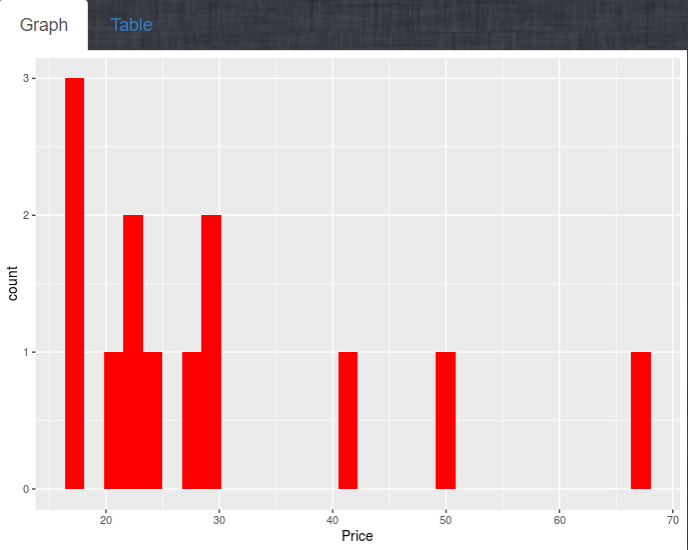

# This is the repo for homework8
## Overview  
* [My website](https://assiduousryan.shinyapps.io/bcliquor/)
* This assignment is a shiny app called "BC liquor". Users can filter the liquor based on conditions like countries, types, prices. The application is tested using Chrome browser. The app is originally developped by Dean Attali, the data is from OpenDataBC. 

## Navigation
* [Source code](./bcl/)
* [app.R](./bcl/app.R) Main logic
* [www](./bcl/www/) storage for images and css

## Features
* Feature1: Add an option to sort the results table by price.  


* Feature2: Add an image of the BC Liquor Store to the UI.  


* Feature3: Use the DT package to turn the current results table  
The code to implement this is as follow:
```
output$bcl_data <- DT::renderDataTable(
	{
		if(input$sort==TRUE){
			bcl_filtered()%>%
			arrange(desc(Price))%>%
			head(input$rowsToShow)
		}
	}
)
```


* Feature4: Add parameters to the plot.
 I use the following code to edit the graph color
```
colourInput("bar","You can choose whatever color you like to fill you plot",value = "red"),
```
 Here is the effect:  
 

* Feature 5: The app currently behaves strangely when the user selects filters that return 0 results

To address the problem, I add some checks to the function. If no data after filtering, then return NULL

You can review this feature in the ```bcl_filterer``` function

* Feature 6: Place the plot and the table in separate tabs
I use the following code to realize this feature
```
tabsetPanel(
	tabPanel(
		"Graph",
		plotOutput("price_hist")
	),
	tabPannel(
		"Table",
		DT::dataTableOutput("bcl_data")
	)
)
```

The effect is as follow:  
 

* Feature 7: Add css to make your app look nicer
Your can find the css file under the www directory
